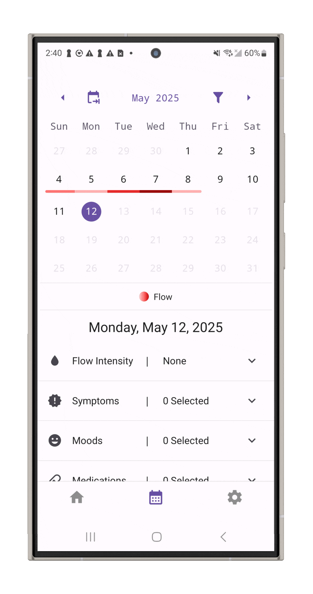
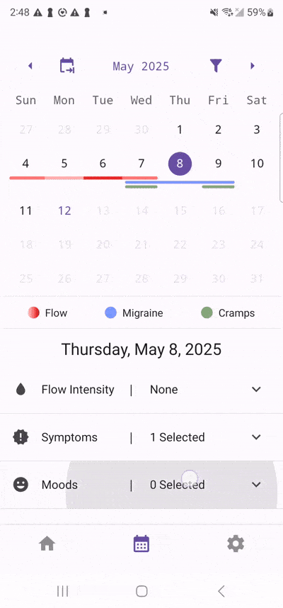
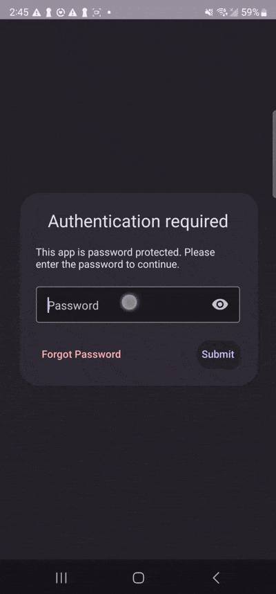
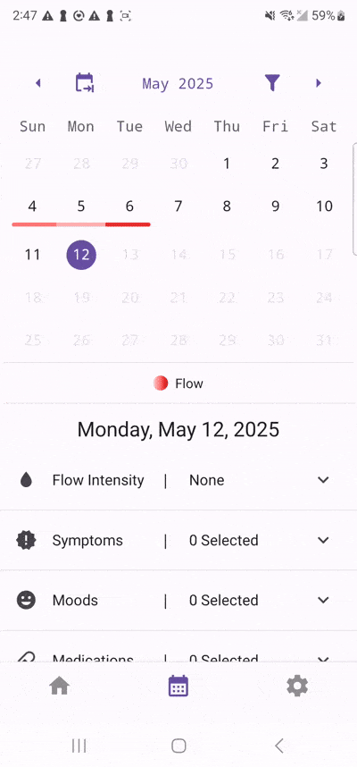

<!-- PROJECT SHIELDS -->
<!--
*** Reference links are enclosed in brackets [ ] instead of parentheses ( ).
*** See the bottom of this document for the declaration of the reference variables
*** for contributors-url, forks-url, etc. This is an optional, concise syntax you may use.
*** https://www.markdownguide.org/basic-syntax/#reference-style-links
-->

[![Angular][TypeScript.org]][TypeScript-url]
[![React Native][React-Native.dev]][React-Native-url]
[![Expo][Expo.dev]][expo-url]
[![SQLite][SQLite.org]][SQLite-url]
[![Android][Android.com]][Android-url]
[![IOS][Apple.com]][Apple-url]

<!-- PROJECT LOGO -->

<!-- ABOUT THE PROJECT -->

## About The Project

Ephira is a local-only, open-source menstrual tracking app designed to prioritize user privacy and data security. It allows users to track their reproductive health without exposing sensitive data to cloud-based platforms or third parties. While there are many privacy-focused menstrual tracking apps out there, many back data up in the cloud or aren't open source.

## Key Features

### Custom Themes & Color Schemes
Personalize your app with six different themes and light/dark mode support based on your device settings.

### Customizable Calendar & Symptom Tracking
Add and track custom symptoms, moods, medications, and more with a smooth, visual calendar interface.

### App Locking with Passcode & Biometrics
Protect your data with Face ID or a custom password unique to Ephira.

### Filter Calendar Legend
Filter your calendar legend to only show the symptoms, moods, and medications you want to see. This makes it easy to focus on the data that matters most to you.

<!-- DEVELOPMENT GOALS -->

## Development Goals

- [ ] Android Play Store Deployment
  - [ ] Review
  - [ ] User Testing
- [ ] Apple App Store Deployment
  - [ ] Review
  - [ ] User Testing
- [ ] App Features
  - [ ] Cycle Prediction
  - [ ] Data Export
  - [ ] Animations
  - [ ] Splash Screen
  - [ ] Menstrual Cycle Insight

See the [open issues](https://github.com/adulbrich/ephira/issues) for a full list of proposed features (and known issues).

<!-- LICENSE -->

## License

[![License][license-shield]][license-url]

See `LICENSE.txt` for more information.

<!-- ACKNOWLEDGMENTS -->

## Acknowledgments

### Top contributors:

<!-- DESIGN GUIDE -->

## Design Guide

### Logo Colors

-  `#f2e4bf`
-  `#9892a0`
-  `#65759a`
-  `#312935`

### Fonts

[Minion Variable Concept](https://fonts.adobe.com/fonts/minion)

<!-- GETTING STARTED -->

## Getting Started

### Running the Project

This is an [Expo](https://expo.dev) project created with [`create-expo-app`](https://www.npmjs.com/package/create-expo-app).

Due to using Expo SQLite for the database, this project will only run on mobile devices.

- Download the repo
- `npm install`
- `npx expo start`
- On your mobile phone (iOS or Android), download the Expo Go app and then scan the QR code in the terminal.

In the output, you'll find options to open the app in a:

- [development build](https://docs.expo.dev/develop/development-builds/introduction/)
- [Android emulator](https://docs.expo.dev/workflow/android-studio-emulator/)
- [iOS simulator](https://docs.expo.dev/workflow/ios-simulator/)
- [Expo Go](https://expo.dev/go), a limited sandbox for trying out app development with Expo

This project uses [file-based routing](https://docs.expo.dev/router/introduction).

### Learn more

To learn more about the libraries we use, look at the following resources:

- [Expo](https://docs.expo.dev/)
- [React Native](https://reactnative.dev/)
- [React Native Paper](https://reactnativepaper.com/)
- [Drizzle (Expo SQLite)](https://orm.drizzle.team/docs/connect-expo-sqlite)

<!-- MARKDOWN LINKS & IMAGES -->
<!-- https://www.markdownguide.org/basic-syntax/#reference-style-links -->

[license-shield]: https://img.shields.io/github/license/adulbrich/ephira.svg?style=for-the-badge
[license-url]: https://github.com/adulbrich/ephira/blob/master/LICENSE.txt
[product-screenshot]: assets/images/feature-graphic.png
[SQLite.org]: https://img.shields.io/badge/sqlite-%2307405e.svg?style=for-the-badge&logo=sqlite&logoColor=white
[SQLite-url]: https://sqlite.org
[Expo.dev]: https://img.shields.io/badge/expo-1C1E24?style=for-the-badge&logo=expo&logoColor=#D04A37
[Expo-url]: https://expo.dev
[React-Native.dev]: https://img.shields.io/badge/react_native-%2320232a.svg?style=for-the-badge&logo=react&logoColor=%2361DAFB
[React-Native-url]: https://reactnative.dev
[TypeScript.org]: https://img.shields.io/badge/typescript-%23007ACC.svg?style=for-the-badge&logo=typescript&logoColor=white
[TypeScript-url]: https://typescriptlang.org
[Android.com]: https://img.shields.io/badge/Android-3DDC84?style=for-the-badge&logo=android&logoColor=white
[Android-url]: https://android.com
[Apple.com]: https://img.shields.io/badge/IOS-%23000000.svg?style=for-the-badge&logo=apple&logoColor=white
[Apple-url]: https://apple.com
